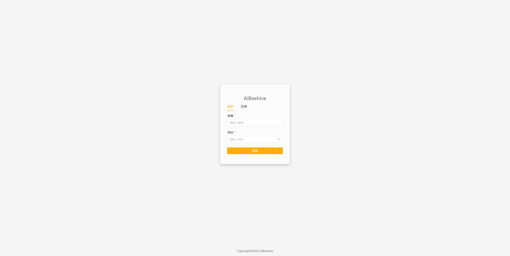
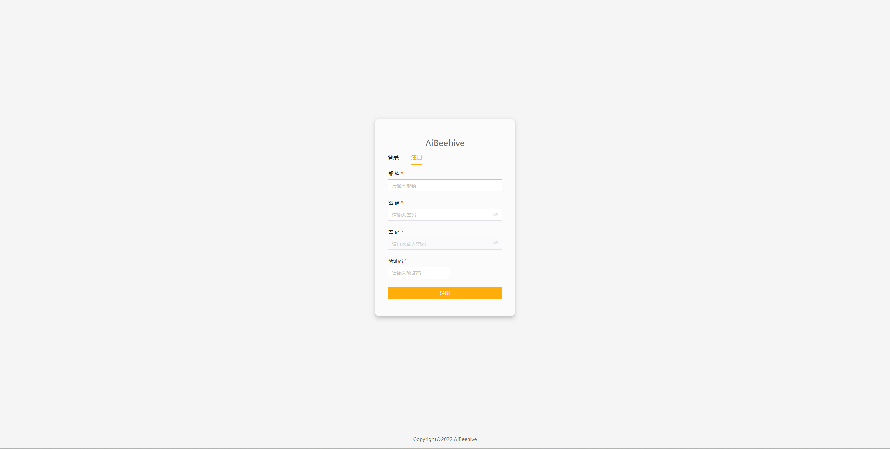
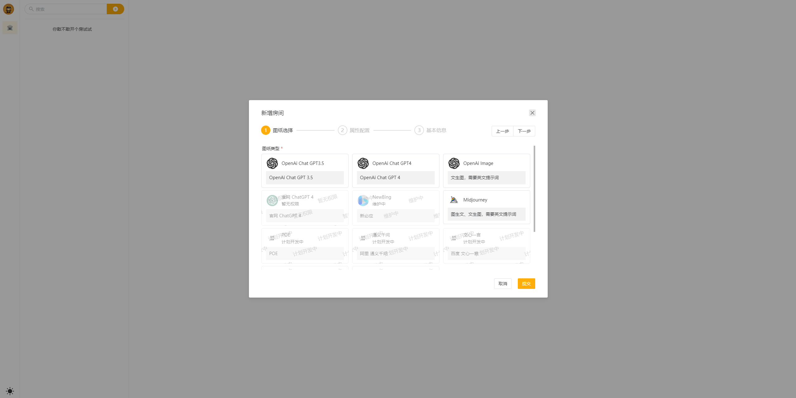
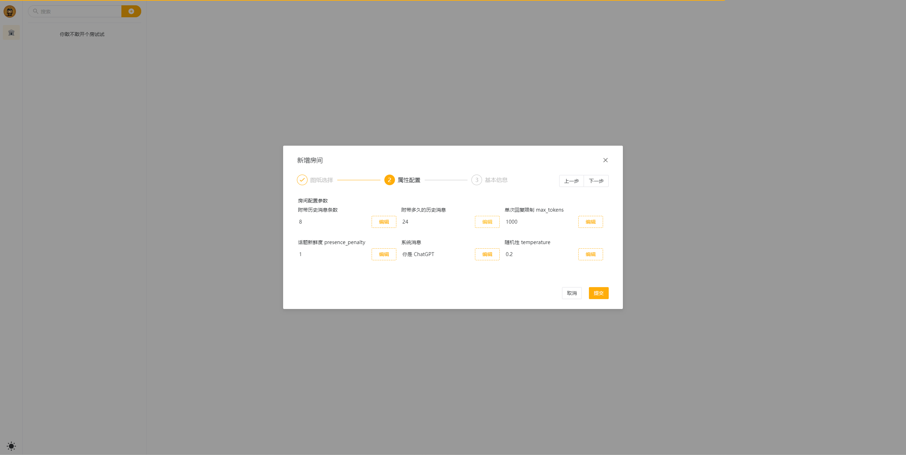
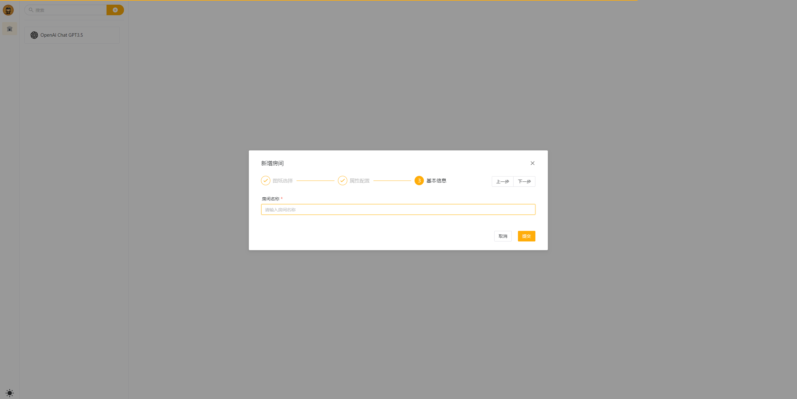
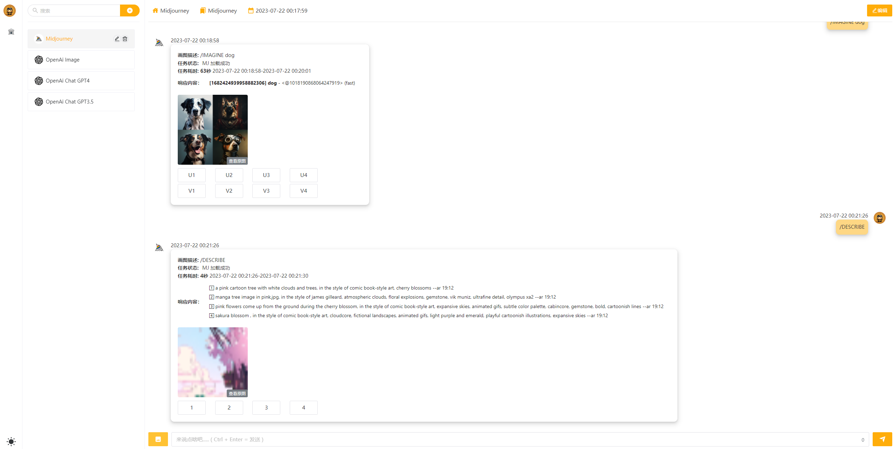
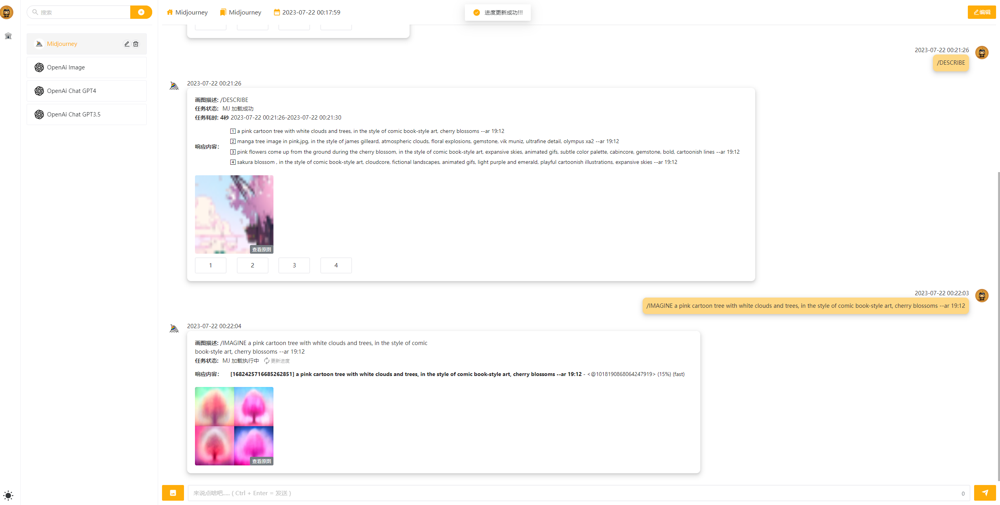
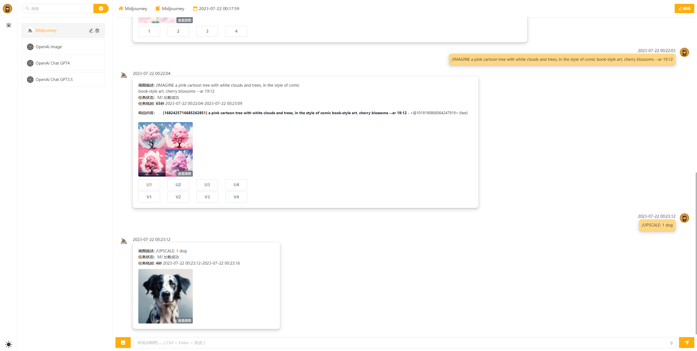
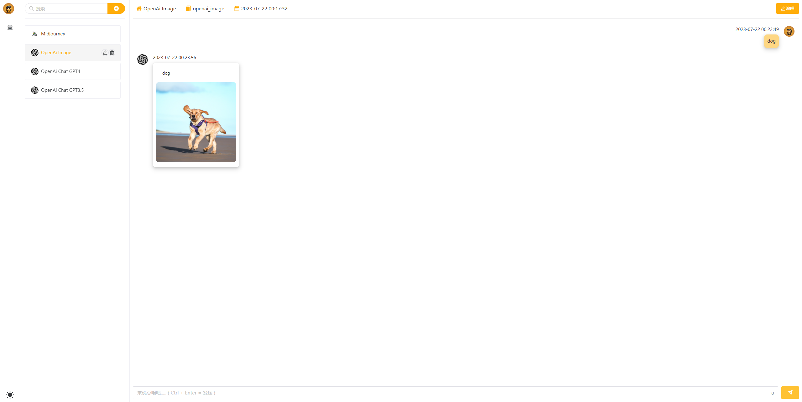
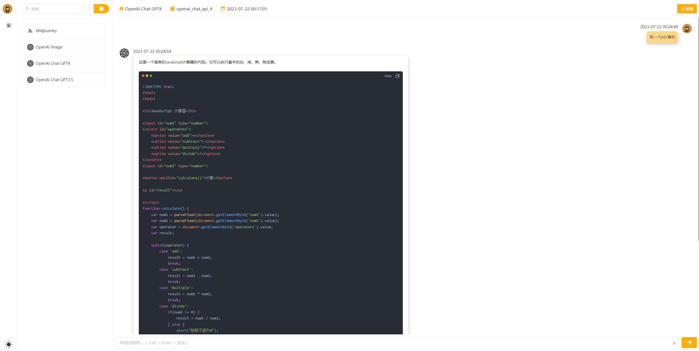

# [ai-beehive](https://github.com/mjjh1717/chatgpt-shuowen)

# ✨ 介绍

- 前端开发👨‍🦲：https://github.com/mjjh1717
- 后端开发👨‍🦲[@hncboy](https://github.com/hncboy)
- 描述：ai-beehive 项目的名字取自蜂巢，这源于我们构建房间的方式，即通过图纸塑造出独特的模块化房间，每个房间都是一个具有个性的聊天室，类似于蜂巢中的单独蜂窝。六边形的蜂窝设计启示我们，系统具有无限的扩展能力。在我们的 ai-beehive项目中，我们提供了一种方式，即通过添加新的图纸来扩展和丰富房间类型.

# 🎬 介绍

## 登录 注册 邮箱校验






## 首页


## 新建房间







## Midjourney







## OpenAi Image



## OpenAi GPT 3.5 & 4 官网 ChatGPT newBing



# 🔭 预览地址

- [客户端 chatgpt-shuowen](https://github.com/mjjh1717/chatgpt-shuowen)
- chatgpt-shuowen 2.0 版本，1.1.0 更名为 ai-beehive（爱蜂巢、AI 蜂巢），体验站：[https://front.aibeehive.icu](https://front.aibeehive.icu/)
- chatgpt-shuowen 1.0 [最终版分支地址](https://github.com/hncboy/chatgpt-web-java/tree/v1.1.0)，体验地址：https://front3.stargpt.top/#/
- [管理端 chatgpt-jiezi](https://github.com/hncboy/chatgpt-jiezi)
- [后台 chatgpt-web-java](https://github.com/hncboy/chatgpt-web-java)

# 🔧 环境配置❗❗❗❗

## 参考环境

| 依赖项 | 版本     |
| ------ | -------- |
| npm    | 8.11.0   |
| node   | v16.15.1 |
| pnpm   | 7.5.0    |

[issues环境相关问题回答](https://github.com/mjjh1717/chatgpt-shuowen/issues/2)

## 本地请求地址

从根目录  .env  文件中的  VITE_APP_API_BASE_URL  修改不同环境中的请求路径

# 📋 计划功能

| 功能                                            | 进度                       |
| ----------------------------------------------- | -------------------------- |
| 登录 邮箱注册                                   | 已完成 ✔️                   |
| 项目布局 房间列表 路由结构搭建                  | 已完成 ✔️                   |
| 根据图纸参数 动态配置 鉴权 新增房间             | 已完成 ✔️                   |
| 日间模式 暗夜模式 适配                          | 已完成 ✔️                   |
| 对话md格式解析                                  | 已完成 ✔️                   |
| 流式获取对话数据,类打字机效果                   | 已完成 ✔️(后续可封装成组件) |
| OpenAi Image                                    | 已完成 ✔️                   |
| OpenAi GPT 3.5 & 4                              | 已完成 ✔️                   |
| 官网 ChatGPT                                    | 已完成 ✔️                   |
| NewBing                                         | 开发者... 👨‍🦽               |
| Midjourney 根据状态定时获取新数据               | 已完成 ✔️                   |
| Midjourney 5s间隔手动更新状态                   | 已完成 ✔️                   |
| Midjourney (Imagine Upscale Variation Describe) | 已完成 ✔️                   |
| 根据图纸参数 动态配置 鉴权 编辑房间             | 开发中... 👨‍🦽               |
| 房间列表分层                                    | 开发中... 👨‍🦽               |
| 文心一眼                                        | 计划开发中... 👨‍🦽           |
| 通义千问                                        | 计划开发中... 👨‍🦽           |
| chatglm                                         | 计划开发中... 👨‍🦽           |
| 绘图的图片画廊                                  | 计划开发中... 👨‍🦽           |

# 🔨构建运行

## 💾 环境准备

```shell
# 克隆项目
git clone https://github.com/mjjh1717/chatgpt-shuowen

cd chatgpt-shuowen

# 安装依赖项(推荐使用 pnpm : https://pnpm.io/zh/installation)
npm i -g pnpm # Installed and can be ignored

pnpm i # or npm i
```

## 🚗 运行

```shell
# 本地运行
pnpm dev
```

## 🚀 构建和发布

```shell
# 打包,打包后的代码再根目录dist文件夹下
pnpm build
```

## 🦼 其他操作

```shell
# 使用eslint校验代码格式问题
pnpm lint

# 使用eslint校验代码格式问题并修复
pnpm lint:fix

# 使用preview修复格式问题
pnpm preview

# 提交代码 包含了 git add . 和 cz-customizable 格式提交
pnpm commit
```

# 📣 风险声明

本项目仅供学习和研究使用，不鼓励用于商业用途。我们不对任何因使用本项目而导致的任何损失负责。

# 🔔 感谢

- 非常感谢大家对我们项目和开发工作的支持和认可。我们深知在开源软件开发过程中，用户和社区的反馈和支持是至关重要的。我们的项目代码已经提供了 README 和 issue，方便用户进行部署和解决问题，同时也可以促进我们项目的活跃度，会优先关注 issue 的问题。
- 然而，对于一些用户可能存在需要二次开发或部署方面的困难，我们在开发任务繁忙的情况下，难以抽出时间回答所有用户的问题，但我们会尽最大努力去回答用户的问题。同时，我们也可以提供付费的解答服务，为用户提供更多的支持。
- 我们的开发工作也在持续进行中，我们会不断迭代优化我们的技术设计方案和业务功能，项目不仅仅会提供所需的业务功能，也可以通过项目来学习一些技术的使用。如果您认为我们的开源项目有价值能帮助到您，并愿意支持我们的开发工作，可以为项目点个小星星或者请作者[喝一杯可乐发电](https://afdian.net/a/stargpt) 。我们将非常感谢。

# 📑 License

Apache-2.0 license © [mjjh](LICENSE)
