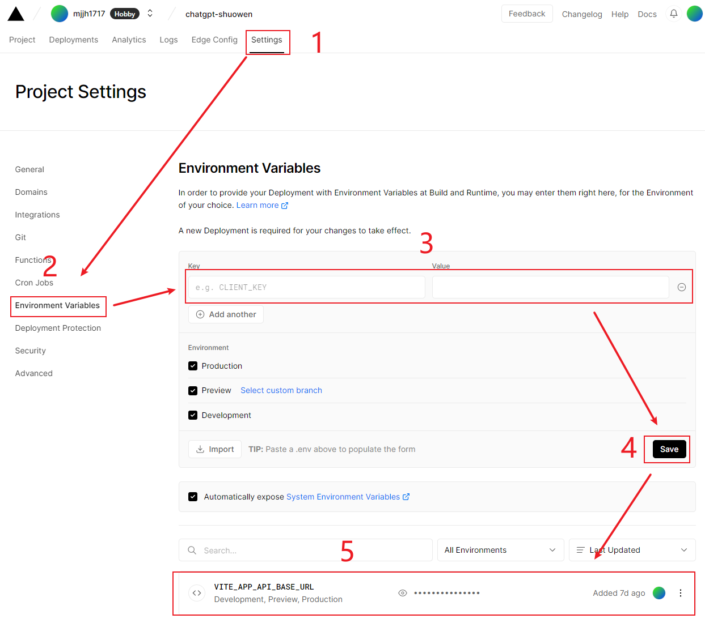

# 说文 [chatgpt-shuowen](https://github.com/mjjh1717/chatgpt-shuowen)

# ✨ 介绍

基于的 [chatgpt-web](https://github.com/Chanzhaoyu/chatgpt-web) 二次开发，适配[后台 chatgpt-web-java](https://github.com/hncboy/chatgpt-web-java)，后续版本开发会在此项目上更新上线新功能

- 前端开发👨‍🦲[@mjjh](https://github.com/mjjh1717)
- 后端开发👨‍🦲[@hncboy](https://github.com/hncboy)
- [客户端 chatgpt-shuowen](https://github.com/mjjh1717/chatgpt-shuowen)
- [管理端 chatgpt-jiezi](https://github.com/hncboy/chatgpt-jiezi)
- [后台 chatgpt-web-java](https://github.com/hncboy/chatgpt-web-java)

# 🔭 预览地址

- 客户端：
- https://front.stargpt.top/ (失效)
- https://front1.stargpt.top/
- https://front2.stargpt.top/
- https://front3.stargpt.top/

# 📋 已实现功能

| 功能                             | 进度         |
| -------------------------------- | ------------ |
| 适配java后端                     | 已完成 ✔️     |
| 多会话储存和上下文逻辑           | 已完成 ✔️     |
| 对代码等消息类型的格式化美化处理 | 已完成 ✔️     |
| 数据导入、导出                   | 已完成 ✔️     |
| 保存消息到本地图片               | 已完成 ✔️     |
| 界面多语言                       | 已完成 ✔️     |
| 界面主题                         | 已完成 ✔️     |
| 登录注册                         | 已完成 ✔️     |
| 邮箱验证                         | 已完成 ✔️     |
| 用户限流...                      | 进行中... 👨‍🦽 |
| 消息模块...                      | 进行中... 👨‍🦽 |

# 🔧 修改配置❗❗❗❗

## 参考环境

| 依赖项 | 版本     |
| ------ | -------- |
| npm    | 8.11.0   |
| node   | v16.15.1 |
| pnpm   | 7.5.0    |

[issues环境相关问题回答](https://github.com/mjjh1717/chatgpt-shuowen/issues/2)

## 本地请求地址

从根目录  .env  文件中的  VITE_APP_API_BASE_URL  修改不同环境中的请求路径

# 🔨构建运行

## 💾 环境准备

```shell
# 克隆项目
git clone https://github.com/mjjh1717/chatgpt-shuowen

cd chatgpt-shuowen

# 安装依赖项(推荐使用 pnpm : https://pnpm.io/zh/installation)
npm i -g pnpm # Installed and can be ignored

# !!!重要 需要初始化husky
pnpm bootstrap # or npm bootstrap

# !!!如果bootstrap安装不成功,可以先执行这两步
pnpm i # or npm i
pnpm run common:prepare # or npm run common:prepare
```

## 🚗 运行

```shell
# 本地运行
pnpm dev
```

## 🚀 构建和发布

```shell
# 打包,打包后的代码再根目录dist文件夹下
pnpm build
```

## 🦼 其他操作

```shell
# 使用eslint校验代码格式问题
pnpm lint

# 使用eslint校验代码格式问题并修复
pnpm lint:fix

# 使用preview修复格式问题
pnpm preview

# 提交代码 包含了 git add . 和 cz-customizable 格式提交
pnpm commit
```

# 🎢 vercel 上线相关配置

当前 vercel 配置有两种方式,当前推荐第一种方式

## 方式1 仅仅使用 [vercel.json](https://vercel.com/docs/concepts/projects/project-configuration#) 配置

- 优点: 简单无需其他操作

- 缺点: 在代码中暴露后端地址

- 操作步骤

  1. 在根目录下新建 vercel.json 文件

  2. 将下面的代码复制到文件中

     - 第一个配置是重写请求路径 第二个配置是重写刷新之后默认返回的页面

     ```json
     {
       "rewrites": [
         {
           "source": "/api/(.*)",
           "destination": "你的服务地址/$1"
         },
         { "source": "/:path*", "destination": "/index.html" }
       ]
     }
     ```

  3. git上传代码,重新自动部署即可


## 方式2 使用  [vercel.json](https://vercel.com/docs/concepts/projects/project-configuration#)  | [Deploying Serverless Functions ](https://vercel.com/docs/concepts/functions/serverless-functions#deploying-serverless-functions) | [vercel env](https://vercel.com/docs/cli/env#)

- 优点: 不暴露后端地址 路径可以卸载 env 配置中

- 缺点: 操作复杂,在聊天中无法流式返回后端内容实现,打字机效果(大佬们如果有解决方案欢迎交流)

- 操作步骤

  1. 在根目录下新建 vercel.json 文件

     - 第一个配置是重写请求路径 第二个配置是重写刷新之后默认返回的页面

     ```json
     {
       "rewrites": [
         {
           "source": "/api/(.*)",
           "destination": "/api/proxy"
         },
         { "source": "/:path*", "destination": "/index.html" }
       ]
     }
     ```

  2. 在根目录下 创建 api 文件夹 在 api 文件夹下创建 proxy.js 文件

     -  此处需要项目安装 http-proxy-middleware 使用如下命令

       ```shell
       pnpm install --save-dev http-proxy-middleware # or npm install --save-dev http-proxy-middleware
       ```

     ```js
     import { createProxyMiddleware } from 'http-proxy-middleware'

     export default (req, res) => {
       let target = ''
       if (req.url.startsWith('/api'))
         target = process.env.VITE_APP_API_BASE_URL

       createProxyMiddleware({
         target,
         changeOrigin: true,
         pathRewrite: path => path.replace('/api', '/'),
       })(req, res)
     }
     ```

  3. 配置 vercel env 变量

     

  4. git上传代码,重新自动部署

# 📬 联系方式

前端技术交流添加微信，备注 Github ChatGPT 以及原因

<div style="display: flex; align-items: center; gap: 20px;">
  <div style="text-align: center">
    
  </div>
</div>


# 📣 风险声明

本项目仅供学习和研究使用，不鼓励用于商业用途。我们不对任何因使用本项目而导致的任何损失负责。

# 🔔 感谢

- 非常感谢大家对我们项目和开发工作的支持和认可。我们深知在开源软件开发过程中，用户和社区的反馈和支持是至关重要的。我们的项目代码已经提供了 README 和 issue，方便用户进行部署和解决问题，同时也可以促进我们项目的活跃度，会优先关注 issue 的问题。
- 然而，对于一些用户可能存在需要二次开发或部署方面的困难，我们在开发任务繁忙的情况下，难以抽出时间回答所有用户的问题，但我们会尽最大努力去回答用户的问题。同时，我们也可以提供付费的解答服务，为用户提供更多的支持。
- 我们的开发工作也在持续进行中，我们会不断迭代优化我们的技术设计方案和业务功能，项目不仅仅会提供所需的业务功能，也可以通过项目来学习一些技术的使用。如果您认为我们的开源项目有价值能帮助到您，并愿意支持我们的开发工作，可以为项目点个小星星或者请作者[喝一杯可乐发电](https://afdian.net/a/stargpt) 。我们将非常感谢。

# 📑 License

MIT © [mjjh](LICENSE)
